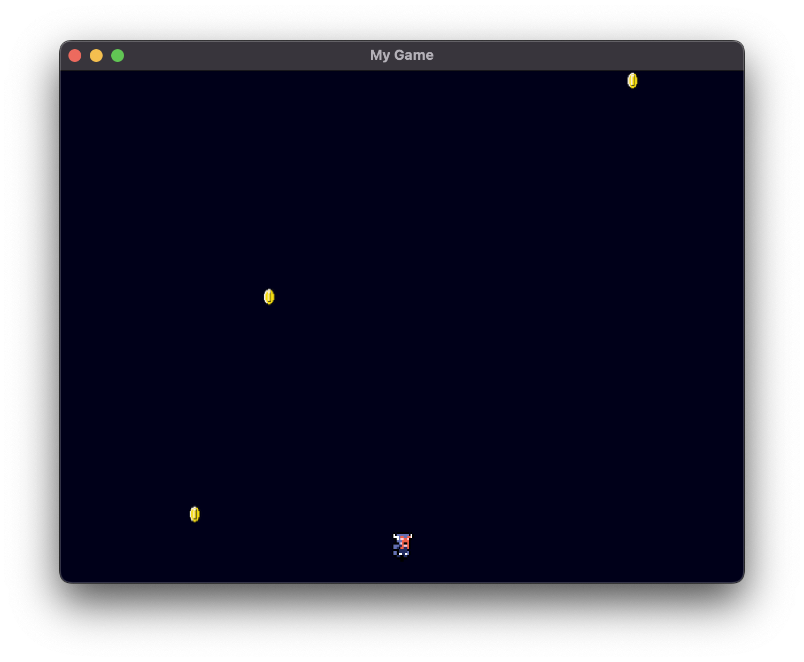

# A Simple Game



Made with libGDX - https://libgdx.com/wiki/start/a-simple-game

## Getting it Running

(Source: https://libgdx.com/wiki/start/import-and-running)

If you want to execute your freshly imported project, you have to follow different steps, depending on your IDE and the platform you are targeting.

All the targets can be run and deployed to via the command line interface.

Desktop:

```
./gradlew desktop:run
```

Android:

```
./gradlew android:installDebug android:run
```

The ANDROID_HOME environment variable needs to be pointing to a valid android SDK before you can do any command line wizardry for Android. On Windows, use: set ANDROID_HOME=​C:/Path/To/Your/Android/Sdk; on Linux and macOS: export ANDROID_HOME=​/Path/To/Your/Android/Sdk. Alternatively you can create a file called “local.properties” with the following content: sdk.dir /Path/To/Your/Android/Sdk.

iOS:

```
./gradlew ios:launchIPhoneSimulator
```

HTML:

```
./gradlew html:superDev
```

Then go to http://localhost:8080/index.html.
